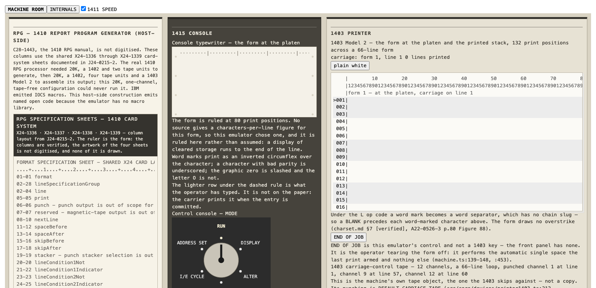

# IBM 1410

A browser emulator of the IBM 1410 in TypeScript, and a family project. A family member read reentry-trajectory output off a 1410 at Avco, by first-hand recollection (no document found places a 1410 there; see `docs/reentry-walkthrough.md` section 10), and this rebuilds that workflow: write a program in Autocoder or RPG, punch it onto cards, load the deck through a 1402 reader, run it on a 1411 CPU from the 1415 console, and read the result on a 1403 line printer. The showcase is a ballistic reentry trajectory, integrated in decimal arithmetic on the emulated machine and printed on emulated green-bar paper.



## What is real and what is reconstructed

**Real**

- **The CPU.** Instruction-accurate, with a cycle counter: it adds up microseconds from IBM's published timing formulas for the base machine (4.5 µs cycle, no Accelerator) and makes no cycle-level timing claim. The instruction table is transcribed from IBM manuals through `docs/research/opcodes.md`. Where the manuals are silent, the code takes a fallback behind a named `OPEN:` constant, and the `PHASE-*-NOTES.md` files list them.
- **What it is checked against.** Jay R. Jaeger's core images `ilentest.cor` (instruction lengths) and `insttest.cor` (index registers, arithmetic, move), against the expected values in his `note1410.txt`; and IBM's CC01A diagnostic (`cc01.cor`). The CC01A pass is a baseline, not independent confirmation. No pass transcript has been published under any simulator, so the end state the check looks for (it types `CC01A` and `CC01 COMPLETE`, then stops on an instruction check at 00322, the ten-character hole where a CE keyed the tape read-in on the real machine) is this project's own first clean run, explained from the listing.
- **The arithmetic in the showcase.** The emulated machine executes 52,406 instructions, 19.14 s of 1411 time, in fixed-point decimal. The printed page shows each integrated velocity beside Allen and Eggers's closed form, so the error is on the paper.

**Reconstructed**

- **The reentry program and its page.** No period trajectory listing survives. The twelve quantities on the page are fixed by the physics (Allen and Eggers, NACA Report 1381; Detra-Kemp-Riddell heating, good to about 10-20 percent). Which column sits at which of the 132 print positions is this project's design, tagged `[unverified]`. The ballistic coefficient is a generic number. Every sheet says `RECONSTRUCTION - NOT FLIGHT DATA`.
- **RPG.** IBM's RPG manual (C28-1443) is not digitised. The generator is a host-side program that reads the shared X24-1336 to X24-1339 specification-sheet layouts and writes open-code Autocoder. It is not IBM's RPG processor, which needed tape units this configuration does not have.
- **The INTERNALS tab.** Registers, core with word marks, indicators: the real 1410 never showed these. It is a deliberate anachronism, kept visually apart from the MACHINE ROOM tab, which is drawn as the operator saw the machine (Selectric roll, MODE rotary, cards, green bar).

**State of the desk**

- The desk machine is a 20,000-position 1411 (Model 2 size, A22-0526-3 p.5). It grew from 10,000 during the build; the reentry program's high-water mark is now 11,132. The project owner accepted the change on 2026-10-02 (`docs/DECISIONS.md`).
- The desk run is paced at 1411 speed. A `1411 SPEED` checkbox, on by default, spends the machine's simulated time as wall-clock time, so the reentry run takes about 19 s. That was measured by hand in Chrome; the test only checks that the pacing code is present.
- DISPLAY and ALTER wrap above 10K, as A22-0526-3 p.51 describes.

## Requirements

- Node `^20.19.0 || >=22.12.0`, which is Vite 8's engine range. The installed Vitest (4.1) declares `^20.0.0 || ^22.0.0 || >=24.0.0`, so avoid Node 23.
- Three devDependencies (TypeScript, Vite, Vitest), no runtime dependencies, no framework.
- **Network on the first `npm test`.** `pretest` runs `npm run oracles`, which downloads four files from `cube1us/1410` on GitHub at a pinned commit (`6f6c8bb`), checks each against a sha256, and writes them to `oracles/` (gitignored): `cc01.cor`, `insttest.cor`, `ilentest.cor` and `note1410.txt`. They are GPL-3.0-or-later upstream, so they are fetched and never committed. A file already in `oracles/` with the right hash is not downloaded again, so copying the four files in by hand from the pinned commit also works offline.
- **If the download fails,** `npm run oracles` prints `ORACLES UNAVAILABLE` and exits 0, and the tiers that need the images skip. `test/oracles-present.test.ts` then fails on purpose, so a green run cannot mean the oracles never ran. `ALLOW_MISSING_ORACLES=1 npm test` turns that one test off. One gap remains: `test/tier3-index-exec.test.ts` errors while collecting when `insttest.cor` is missing, so an offline run still shows one failed file. A checksum mismatch deletes the file and exits 1, which stops `npm test`.

## Commands

Run `npm install` first. Flags after the script name need `--`. `cc01`, `demo`, `asm` and `rpg` compile `tools/` to `build/` before they run.

```
npm run dev                                      # the desk and the INTERNALS tab (Vite dev server)
npm test                                         # the suite, minus the tier-4 tests; fetches the oracles first
npm run smoke                                    # the tier-4 end-to-end tests; also fetches the oracles first
npm run cc01                                     # run IBM's CC01A diagnostic image; prints PASS at 00322
npm run demo -- demos/reentry.cards              # key the bootstrap, run the deck, print the 1415 log and 1403 page
npm run asm  -- demos/reentry.asm --listing      # assemble Autocoder source; --deck out.cards writes the object deck
npm run rpg  -- demos/reentry-summary.rpg --page # generate, assemble and run an RPG job over demos/reentry-summary.data.cards
npm run build                                    # static site into dist/
```

`demo`, `asm` and `rpg` take `--golden <file>` to compare their output byte for byte with a stored page, and `--update` to rewrite it. `rpg` also takes `--source`, `--map` and `--listing`. Also available: `npm run typecheck` and `npm run check:deferred`.

The built page needs an HTTP server. It does not open from `file://`, because the browser blocks the module script (`docs/DECISIONS.md`, 2026-09-02).

## Where to start reading

1. `docs/reentry-walkthrough.md`. The reentry job at the desk and at the command line, written for a reader who does not program.
2. `docs/research/opcodes.md` is the spec `src/core/isa/table.ts` is written from: one OpForm per §2 row, in §2's order, with §2's columns (`,` and `⌑` are one row in §2 and three forms in the table). Open them side by side; if they disagree, the code is wrong.
3. `docs/plans/architecture.md`. Section 0 gives the four decisions that generate the machine, section 10 the dependencies and oracle licensing, section 12 what is not built.

**The code.** The core is a DOM-free library; the UI consumes it.

| Where | What |
|---|---|
| `src/core/` | Storage, registers, ALU, instruction table, CPU, channel 1, and the 1402, 1403 and 1415 devices. |
| `src/formats/` | Cards and Hollerith, object decks, the condensed loader, `.cor` core images. |
| `src/asm/`, `src/rpg/` | The Autocoder assembler and the RPG generator. |
| `src/ui/` | `period/` is the MACHINE ROOM desk; `internals/` is the INTERNALS tab. |
| `tools/`, `demos/` | The command-line tools behind `npm run demo`, `asm`, `rpg` and `cc01`, and the programs they run. |
| `oracle/`, `test/` | Fixtures transcribed from the manuals, and the tests. `test/golden/` holds the stored printed pages. |

**The record.** The project was built by AI agents under phase gates, with a separate agent reviewing each wave and each phase branch adversarially before merge, and the owner's rulings recorded with dates. The files below are that record. Claude models did the work: Fable and Opus orchestrated and reviewed, Opus and Sonnet ran as workers, under the model policy in `CLAUDE.md`. The exception is Phase 5, the RPG generator in `src/rpg/`, which OpenAI Codex models built (`docs/DECISIONS.md`, 2026-09-01). Corrections are written in place with their dates, not deleted.

| Where | What |
|---|---|
| `PHASE-*-NOTES.md` | One per phase. The fallbacks taken, plan deviations, research corrections and open items carried out. |
| `docs/BUILD-LOG-*.md` | Wave-by-wave logs, written by the build orchestrator from its own verification runs. `BUILD-LOG.md` is Phase 1. |
| `docs/plans/` | `architecture.md` and one plan per phase, written before the build, plus the design-panel dossiers behind two of them. Phase plans are left as written once their build starts. |
| `docs/DECISIONS.md` | Dated owner rulings and merge records, tagged `[settled]`, `[proposed]` or `[open]`. |
| `docs/STATUS.md` | Hand-off status, newest entry first. |
| `docs/research/` | IBM 1410 facts, each tagged `[verified]`, `[likely]`, `[observed]` or `[unverified]`. `METHOD.md` says how it was produced; `open-questions.md` lists what is still open. |
| `docs/research/raw/` | Research-agent captures, kept as returned. The `.md` files supersede them, and they include claims that were later refuted, by design. |

## Scope and limits

- No tape, no disk, no FORTRAN, no 1401 compatibility mode. One channel: no channel 2, no processing overlap, no Priority feature; their instructions are rejected.
- One machine: 1411 CPU, 1402 reader/punch, 1403 Model 2 printer, 1415 console.
- Autocoder is the standalone C28-0309-1 dialect: no macros, no IOCS.
- Deferred and unresolved items are in `docs/deferred-work-register.md`. `npm run check:deferred` evaluates their triggers.

## Credits

- Jay R. Jaeger, [github.com/cube1us/1410](https://github.com/cube1us/1410): the core images and `note1410.txt` (GPL-3.0-or-later, fetched at test time) that the CPU is checked against. The tier-3 tests replay his `insttest.cor` against the cycle-by-cycle annotations in his `note1410.txt`; `oracle/note1410/` cites them by line.
- Richard Cornwell's SimH `i7010`: reference only, no code copied.
- [bitsavers.org](https://bitsavers.org) for the IBM manuals, cited by form number and not vendored.
- Allen and Eggers, NACA Report 1381 (1958), for the reentry model.

IBM is a trademark of International Business Machines Corporation. This project is not affiliated with or endorsed by IBM.

## License

MIT. See `LICENSE`, and `NOTICE` for third-party material.

## Contributing

The project is complete as built. There is no Phase 7 (`PHASE-6-NOTES.md`, section 4). Issues are welcome for bugs and for historical corrections that cite a manual by form number and page; say which machine a fact applies to, because 1401 is not 1410. There is no feature roadmap.
